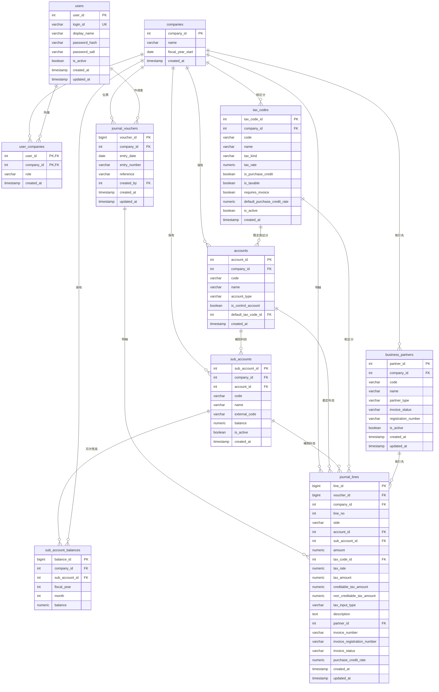

# AccountingApp ER図

このER図は `Database/schema.sql` を元にした現在のデータベース構造です。

現在の仕訳データは `journal_vouchers` と `journal_lines` が主系統です。旧方式の `journal_entries` は廃止済みです。

## 主系統

## 主要な一意制約

- `users.login_id`
- `user_companies(user_id, company_id)`
- `accounts(company_id, code)`
- `sub_accounts(company_id, account_id, code)`
- `tax_codes(company_id, code)`
- `business_partners(company_id, code)`
- `journal_vouchers(company_id, entry_number)`
- `journal_lines(voucher_id, line_no)`
- `sub_account_balances(company_id, sub_account_id, fiscal_year, month)`

## 現在の設計メモ

- 会社ごとに勘定科目、補助科目、税区分、取引先を持ちます。
- ユーザーと会社は `user_companies` で多対多です。
- 仕訳は `journal_vouchers` が伝票ヘッダ、`journal_lines` が借方/貸方の明細です。
- 複合仕訳は `journal_lines` に複数明細としてそのまま保持します。
- 出納帳・仕訳帳・仕訳編集は新方式の仕訳テーブルを参照します。
- インボイス対応項目は `business_partners` と `journal_lines` にあります。
- 旧仕様の `journal_entries` は削除対象です。既存DBでは `schema.sql` 実行時に `DROP TABLE IF EXISTS journal_entries` で撤去します。
